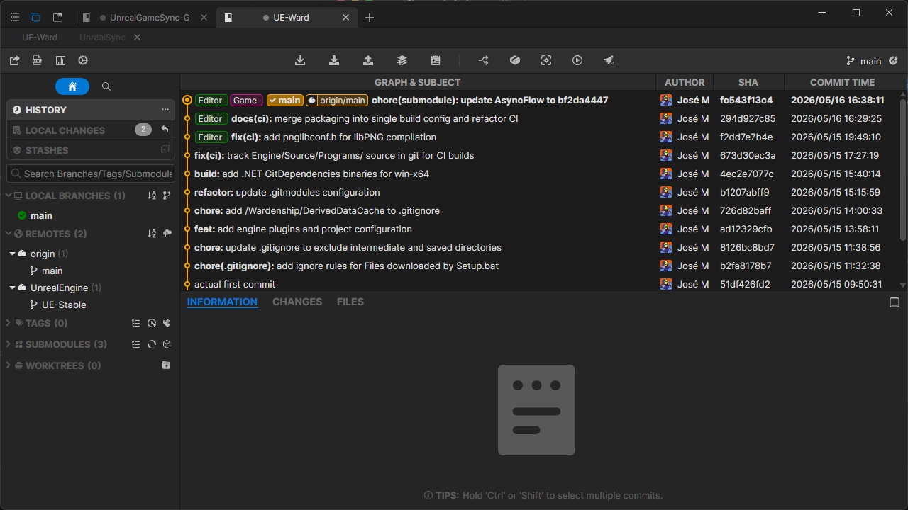
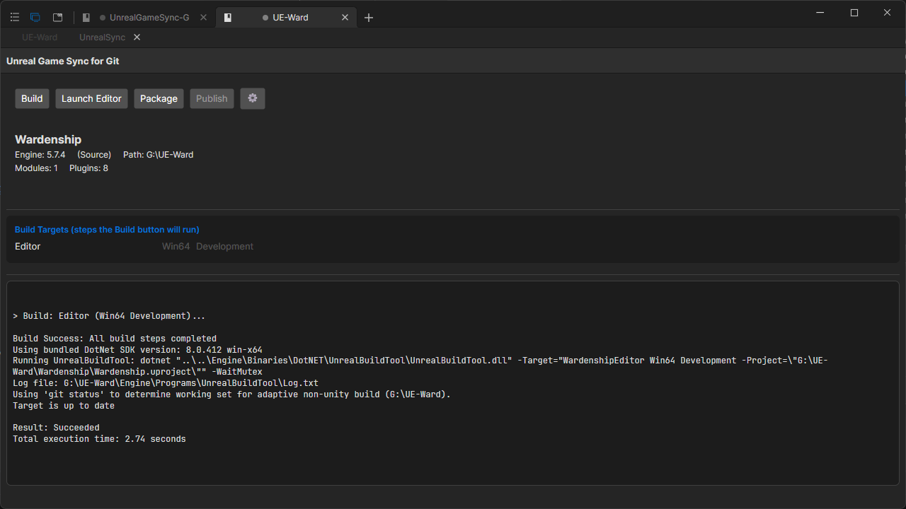
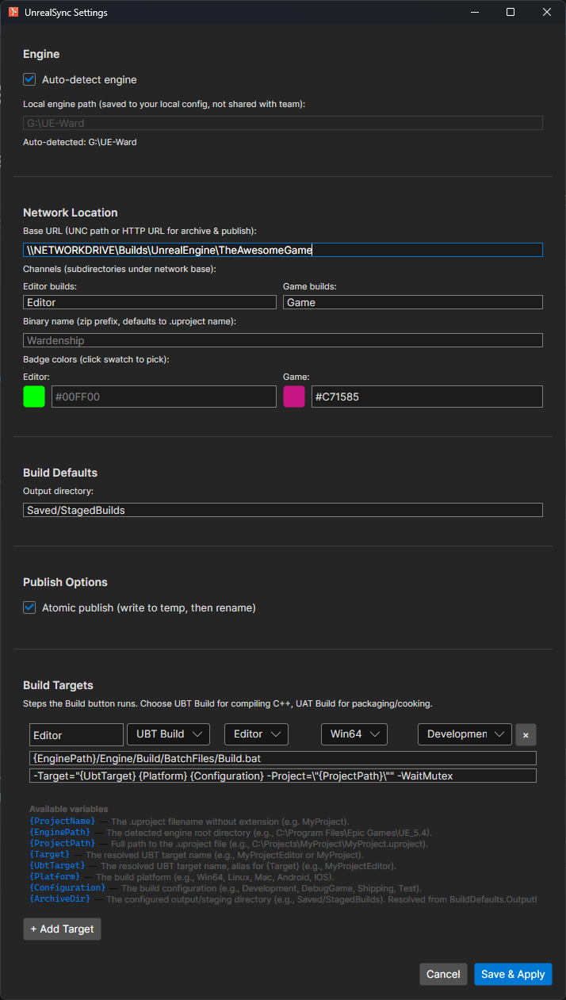
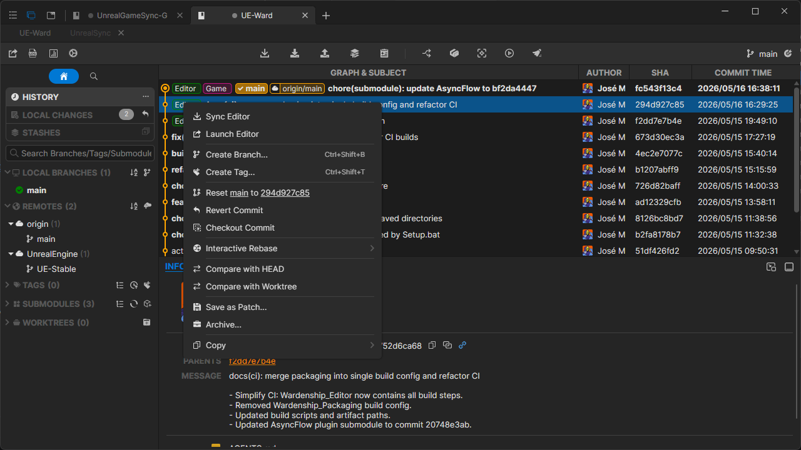

# UGSGit - Unreal Game Sync Git Client

## What is this

If you've used Unreal Engine with Perforce, you've probably heard
of [Unreal Game Sync](https://dev.epicgames.com/documentation/unreal-engine/unreal-game-sync-ugs-for-unreal-engine?lang=en-US)
(UGS): a tool that lets teams sync prebuilt editor binaries, manage workspaces, and stay on the same commit without
everyone compiling from source. It's a workflow that keeps large teams moving fast.

**UGSGit** brings that same workflow to Git.

It's an open-source Git GUI forked from [SourceGit](https://github.com/sourcegit-scm/sourcegit), built around an
UnrealSync plugin that handles the things UGS does for Perforce: downloading matching editor builds, triggering CI
builds, packaging and publishing artifacts, and launching the editor, all tied to specific commits in your graph.
No more "which build matches this commit?" guesswork.

On top of that, you get a full-featured Git client: visual commit graph, interactive rebase, blame, diff, GitFlow,
and an extensible plugin system so teams can add their own tabs, commit annotators, and context menu actions.

> [!WARNING]
> **This project is in very early development.** Core features are actively changing, the plugin API is not yet stable,
> and breaking changes should be expected between releases. Use at your own risk; we'd love feedback and contributions,
> but it is not production-ready.
>
> **Windows only for now.** macOS and Linux builds exist (inherited from SourceGit) but the UnrealSync plugin and its
> editor sync/build/publish workflows are only tested on Windows.

## Core Functionality

### Git Client

- Visual commit graph with branch/decorator rendering
- Clone, fetch, pull, push, merge, rebase, cherry-pick, bisect
- SSH key management per remote and branch/tag/stash/submodule/worktree support
- Diff viewer (text, image side-by-side/swipe/blend), blame, file history
- Interactive rebase, conventional commit helper, AI-generated commit messages
- Custom actions, GitFlow, Git LFS, issue tracker linking

### UnrealSync Plugin

- **Editor Binary Sync**: Download precompiled editor binaries from a network share that match your current commit
- **Build & Package**: Build Editor, Game, or Server targets and produce zipped archives
- **Publish**: Upload archives to a network share or GitHub Actions artifact store
- **Workspace Management**: Auto-detect engine path, sync to latest, launch editor
- **Commit Annotations**: Visual badges in the commit graph showing which commits have prebuilt binaries available
- **Context Menu Actions**: Right-click any commit to "Sync Editor" or "Launch Editor"

### Extensibility

- Plugin system with `IPluginManifest` / `IRepositoryTab` / `ICommitAnnotator` / `ICommitMenuContributor`
- Built-in plugins: `HelloWorld` (reference), `UnrealSync` (UE workspace)
- External plugins via isolated `AssemblyLoadContext`

## Screenshots

### UGSGit Main Window

<p align="center">

</p>

The main repository view showing the visual commit graph, branch/tag decorators, file tree, and diff viewer in the dark
theme.

### UnrealSync Plugin: Workspace Tab

<p align="center">

</p>

The UnrealSync plugin tab displays real-time workspace status: current Git commit, Unreal Engine version, detected
engine path, module/plugin counts, and one-click action buttons for Sync, Build, Package, Publish, and Launch Editor.

### UnrealSync Plugin: Settings

<p align="center">

</p>

Settings dialog for configuring engine path, build targets, package profiles, and network channels for publishing
artifacts.

### Commit Graph: Editor Context Menu

<p align="center">

</p>

Right-click any commit in the visual graph to trigger "Sync Editor" (download matching prebuilt binaries) or "Launch
Editor" directly. Build availability is shown as a green annotation badge.

## Installation

Download the latest release from [GitHub Releases](https://github.com/nievesj/UnrealGameSync-Git/releases/latest),

> [!CAUTION]
> **MSYS Git is NOT supported on Windows.** Use official [Git for Windows](https://git-scm.com/download/win) instead.

**Data storage location:**

| OS      | Path                  |
|---------|-----------------------|
| Windows | `%APPDATA%\SourceGit` |

## Quick Start

```sh
dotnet restore
dotnet build
dotnet run --project src/UGSGit.csproj
```

Requires .NET SDK 10+ (see `global.json`). See [AGENTS.md](AGENTS.md) for full build instructions and architecture
details.

## Contributing

PRs target the `develop` branch. Make sure your PR is based on the latest `develop`.

```sh
git checkout develop
git pull origin develop
git checkout -b my-feature
# ... make changes ...
dotnet format src/UGSGit.csproj
git commit -m "feat: my feature"
git push origin my-feature
```

## License

[MIT](LICENSE) · Forked from [SourceGit](https://github.com/sourcegit-scm/sourcegit).