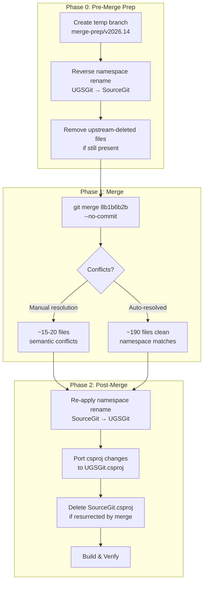
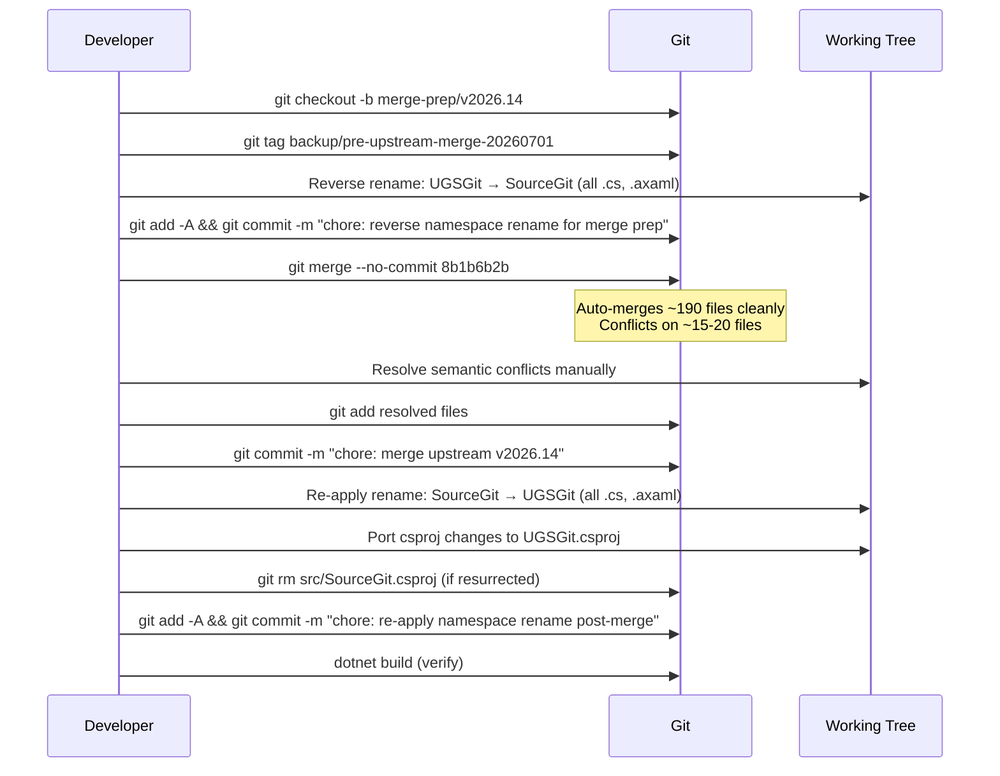

# Technical Design Document: Upstream Integration — SourceGit v2026.14

> **Status:** Draft (revised after council review)
> **Author(s):** José M. Nieves
> **Last Updated:** 2026-07-01
> **Related docs:** `specs/merge-upstream-v2026.11.openspec.md` (prior merge spec, in git history at `e8ff1d99`)
> **Council review:** 2/5 councillors responded (DeepSeek V4 Pro, Kimi K2.7 Code) — full consensus on all critical findings. 3 councillors timed out.

---

## Table of Contents

1. [TL;DR](#1-tldr)
2. [Context & Scope](#2-context--scope)
3. [Goals & Non-Goals](#3-goals--non-goals)
4. [Proposed Solution](#4-proposed-solution)
5. [Assumptions & Dependencies](#5-assumptions--dependencies)
6. [Alternatives Considered](#6-alternatives-considered)
7. [Cross-Cutting Concerns](#7-cross-cutting-concerns)
8. [Testing Strategy](#8-testing-strategy)
9. [Deployment & Rollout Plan](#9-deployment--rollout-plan)
10. [Open Questions](#10-open-questions)
11. [Risks & Mitigations](#11-risks--mitigations)
12. [Timeline & Milestones](#12-timeline--milestones)
13. [Document History](#13-document-history)

---

## 1. TL;DR

We need to integrate 263 upstream commits (SourceGit release v2026.14, commit `8b1b6b2b`) into the UGSGit fork while preserving all fork-specific functionality: the plugin system, UnrealSync plugin, namespace rename, custom build project, and UI modifications. The proven strategy from the v2026.11 merge — **reverse-rename, merge, re-rename** — eliminates ~190 mechanical namespace conflicts, leaving only ~15–20 files requiring genuine manual conflict resolution. Total estimated effort: 12–22 hours (revised after detailed planning; see [§12 Timeline](#12-timeline--milestones)).

---

## 2. Context & Scope

### 2.1 Current State

UGSGit is a fork of [SourceGit](https://github.com/sourcegit-scm/sourcegit), an Avalonia-based desktop Git GUI. The fork adds:

- **Plugin system** — `IPluginManifest`, `PluginRegistry`, `PluginLoader`, `PluginActivator`, `PluginContext`, per-repo enable/disable, external DLL loading
- **Built-in plugins** — `HelloWorld` (reference) and `UnrealSync` (Unreal Engine workspace sync, build, launch)
- **Plugin abstractions library** — `libs/UGSGit.PluginAbstractions/` (zero-dependency, NuGet-packable contract library)
- **Namespace rename** — `SourceGit.*` → `UGSGit.*` across all source files (~500+ files)
- **Custom build project** — `src/UGSGit.csproj` replacing `src/SourceGit.csproj` (deleted), with plugin project references, `DISABLE_PLUGINS` AOT define, `TrimmerRootAssembly` entries for plugins
- **UI modifications** — plugin tab bar in `LauncherPage.axaml`, plugin tab bar styles in `Styles.axaml`, commit context menu contributors, BuildGraph integration
- **Custom startup args** — `--history`, `--blame`, `--core-editor`, `--rebase-todo-editor`, `--rebase-message-editor`, `UGSGIT_LAUNCH_AS_ASKPASS`
- **Modified self-update URL** — points to fork's `VERSION.json` on GitHub
- **Commit annotation system** — code/content badges, commit type annotations

The last upstream merge was **v2026.11** (merge base `11a7f327`), performed on 2026-05-19 using the reverse-rename strategy. That merge is documented in `specs/merge-upstream-v2026.11.openspec.md` (in git history at commit `e8ff1d99`).

### 2.2 Problem Statement

Upstream has released **v2026.14** (commit `8b1b6b2b38fae33496fb2deacd01b9b490fe98bb`), containing 263 commits since our merge base. These include major features: merge conflict editor redesign, GitFlow refactoring (supporting both `git-flow` and `git-flow-next`), branch tree refactoring, type-changed diffs support, bare repository support, popup/menu styling overhaul, `MacOSTrafficLightsSpacer`, `BookmarkSelector` custom control, statistics chart improvements, standalone commit detail/revision compare windows, and many bug fixes.

We need to integrate these changes without losing any fork-specific functionality. The primary risk is that both sides have modified 203 overlapping files, though most of the fork's changes in those files are mechanical namespace renames.

### 2.3 Key Numbers

| Metric | Value |
|---|---|
| Merge base | `11a7f327` (release v2026.11) |
| Upstream target | `8b1b6b2b` (release v2026.14) |
| UGSGit commits since merge base | 60 |
| Upstream commits since merge base | 263 |
| Files changed in UGSGit (src/ + libs/) | 752 |
| Files changed in upstream (src/) | 225 |
| Overlapping files (both sides modified) | 203 |
| Overlapping files (excluding locales/plugins) | 190 |
| UGSGit-only new files (plugins, libs/) | ~560 |
| Upstream new files | 15 |
| Upstream deleted files | 4 |
| Upstream renamed files | 3 (`CheckoutCommit` → `CheckoutDetached`) |

**Note:** Upstream adds 2 new locale files (`el_GR.axaml`, `he_IL.axaml`) but the locale registry in `src/Models/Locales.cs` has a hardcoded `Supported` list that will NOT auto-merge. This file must be manually edited post-merge to add `new Locale("Ελληνικά", "el_GR")` and `new Locale("עברית", "he_IL")`.

---

## 3. Goals & Non-Goals

### Goals

1. **Integrate all 263 upstream commits** from v2026.11 → v2026.14 into the UGSGit fork
2. **Preserve 100% of fork-specific functionality** — plugin system, UnrealSync, namespace, custom project, UI modifications, commit annotations, BuildGraph integration
3. **Zero regressions** — all existing UGSGit features must work identically post-merge
4. **Clean git history** — merge commit preserves both histories; no squashing of fork commits
5. **Build passes** — `dotnet build` succeeds in both Debug and Release configurations
6. **Namespace consistency** — zero `SourceGit` references remain in source code post-merge

### Non-Goals

- **Upgrading to Avalonia 12.x** — upstream upgraded to 12.0.4 then downgraded back to 11.3.18; we will take the 11.3.18 version but will not independently pursue a 12.x upgrade
- **Refactoring the plugin system** — the plugin architecture stays as-is; no changes to `IPluginManifest`, `PluginContext`, or service injection patterns
- **Adding new tests** — the project has no test suite (per AGENTS.md); we will verify manually and via build checks
- **Merging upstream locale translations** beyond what git auto-merges — locale files are auto-merged; manual translation review is a follow-up task

---

## 4. Proposed Solution

**The "Reverse-Rename, Merge, Re-Rename" strategy**, proven in the v2026.11 merge, is the recommended approach. This strategy temporarily reverts the fork's namespace rename (`UGSGit` → `SourceGit`) so the working tree matches upstream's expected namespaces, performs the merge with minimal conflicts, then re-applies the namespace rename (`SourceGit` → `UGSGit`) post-merge. This eliminates ~190 mechanical namespace conflicts, leaving only ~15–20 files with genuine semantic conflicts that require manual resolution.

The key insight is that the fork's changes to overlapping files are almost entirely namespace renames. The functional code in shared SourceGit files is largely untouched by the fork. This makes merging primarily a mechanical namespace-substitution exercise, not a semantic conflict resolution effort.

### 4.1 Architecture Diagram



### 4.2 Component & Module Design

The merge affects these component groups differently:

| Component Group | Files | Impact | Strategy |
|---|---|---|---|
| Plugin system (new files) | ~11 src/ + 82 libs/ | **None** — upstream doesn't touch these | No action needed; merge auto-preserves |
| Mechanical namespace-only files | ~480 | **Low** — only namespace/BOM changes | Reverse-rename eliminates all conflicts |
| Locale files | 13 | **Low** — both sides add keys in different locations | Auto-merge; verify `avares://` URIs post-rename |
| Substantive shared files | ~15–20 | **High** — real semantic conflicts | Manual 3-way merge resolution |

> **Action required before merge:** Run `git diff --stat 11a7f327 HEAD -- src/` to generate the full list of 203 overlapping files. Categorize each as 'namespace-only' or 'manual resolution needed'. The 7 files listed below are known high-risk; the remaining ~8–13 must be identified from this diff output. Do NOT assume the remaining files are namespace-only without verification.
| Upstream new files | 15 | **None** — new to fork | Auto-merged; namespace rename handles them |
| Upstream deleted files | 4 | **Low** — may still exist in fork | Remove before merge if present |
| Upstream renamed files | 3 | **Low** — `CheckoutCommit` → `CheckoutDetached` | Git rename detection handles automatically |
| `Models/Locales.cs` | 1 | **High** — hardcoded locale list, not auto-merged | Manual: add `el_GR` + `he_IL` entries |
| `Views/CheckoutCommit.*` | 3 | **High** — upstream renamed to `CheckoutDetached` | Accept upstream rename, update 2 references in `Histories.cs:405` + `Histories.axaml.cs:1011` |
| `ViewModels/LauncherPage.cs` | 1 | **High** — most fork-modified file (plugin tab system) | Manual: re-apply `ActivateEnabledPlugins`/`OnPluginStateChanged` hooks |
| `Views/Welcome.axaml.cs` | 1 | **Medium** — fork added plugin settings menu items | Manual: re-apply plugin menu items after upstream menu changes |
| `Resources/Icons.axaml` | 1 | **Medium** — both sides added icons | Union merge if keys don't collide; verify fork icons present |
| `.gitignore` | 1 | **High** — line 52 `/.github` hides CI folder | Remove `/.github` before merge to allow CI workflow integration |
| `SourceGit.csproj` | 1 | **High** — deleted by fork, modified by upstream | Manually port changes to `UGSGit.csproj` |

### 4.3 API / Interface Design

No external API changes are introduced by this merge. The merge is purely an integration of upstream changes into the fork. However, several internal interfaces change:

**Upstream API changes that affect fork code:**

| Interface/Type | Change | Impact on Fork |
|---|---|---|
| `Models.GitFlow` | `Master` → `ProductionBranch`, `Develop` → `DevelopmentBranch`; new `Parse(config)` method | Fork only changed namespace — auto-handled |
| `ViewModels.Repository.BuildBranchTree()` | Signature changed: added `bool` parameter | Fork only changed namespace — auto-handled |
| `ViewModels.Repository.LocalBranchesCount` | New property added | Fork only changed namespace — auto-handled |
| `Models.RepositoryUIStates` | `IsDateTimeColumnVisibleInHistory` → `IsAuthorTimeColumnVisibleInHistory` + `IsCommitTimeColumnVisibleInHistory`; `BuildHistoryParams()` → `BuildHistoryParams(string gitDir)` | Fork added `ActiveTabId`, `PerRepoPluginOverrides` — manual merge needed |
| `ViewModels.Launcher.OpenRepositoryInTab()` | Signature changed: takes `string repo` instead of `RepositoryNode node` | Fork added `PromoteToRepositoryPage()` — manual merge needed |
| `Models.Branch` | Properties made `readonly`; rename creates new instance instead of mutating | Fork only changed namespace — auto-handled |
| `App.axaml.cs` arg parsing | Path normalization: `.Replace('\\', '/').Trim('"').Trim()` | Fork added plugin init — manual merge needed |

### 4.4 Key Flows



#### Conflict Resolution Strategy

After `git merge --no-commit 8b1b6b2b`, git will leave conflict markers in files that both sides modified. Follow this workflow:

1. **List conflicted files:** `git diff --name-only --diff-filter=U`
2. **Prioritize high-risk files first** — resolve these before touching namespace-only conflicts:
    - `src/App.axaml.cs` (plugin init ordering — see §4.7.3)
    - `src/ViewModels/LauncherPage.cs` (plugin tab hooks)
    - `src/Models/RepositoryUIStates.cs` (fork additions vs. upstream renames)
    - `src/ViewModels/Launcher.cs` (`PromoteToRepositoryPage` vs. new signature)
    - `src/Views/Histories.axaml.cs` (context menu contributors)
3. **For each file:** Open in IDE merge editor or `git mergetool`. Accept upstream's changes for namespace-only regions. Preserve fork additions verbatim.
4. **After resolving each file:** `git add <file>` to mark it resolved.
5. **Verify no remaining conflicts:** `git diff --name-only --diff-filter=U` should return empty.
6. **Only then commit:** `git commit -m "chore: merge upstream v2026.14"`

### 4.5 Technology Stack

| Layer | Technology | Version (Current) | Version (After Merge) | Change Source |
|---|---|---|---|---|
| Language | C# | .NET 10 | .NET 10 | No change |
| UI Framework | Avalonia | 11.3.15 | 11.3.18 | Upstream bumped |
| MVVM | CommunityToolkit.Mvvm | 8.4.2 | 8.4.2 | No change |
| AI | Azure.AI.OpenAI | 2.9.0-beta.1 | 2.9.0-beta.1 | No change |
| AI | OpenAI | 2.10.0 | 2.10.0 | No change |
| Charts | LiveChartsCore.SkiaSharpView.Avalonia | 2.0.0 | 2.0.0 | No change (fork-only dependency) |
| Image | Pfim | 0.11.4 | 0.11.4 | No change |
| Image | StbImageSharp | 2.30.15 | 2.30.15 | No change |
| Image | BitMiracle.LibTiff.NET | 2.4.660 | 2.4.660 | No change |
| DBus | Tmds.DBus.Protocol | 0.93.0 | 0.93.0 | No change (fork-only dependency) |
| Fonts | JetBrains Mono | JetBrainsMono-*.ttf | JetBrainsMonoNL-*.ttf | Upstream renamed (NL variant) |

### 4.6 Migration Strategy

#### 4.6.1 Pre-Merge: Files Deleted Upstream

Upstream deleted 4 files since our merge base. If any still exist in our fork, they must be removed before merging:

| File | Reason for Upstream Deletion |
|---|---|
| `src/Commands/QueryStagedFileBlobGuid.cs` | Functionality removed/refactored |
| `src/Resources/Fonts/JetBrainsMono-Bold.ttf` | Replaced by NL variant |
| `src/Resources/Fonts/JetBrainsMono-Italic.ttf` | Replaced by NL variant |
| `src/Resources/Fonts/JetBrainsMono-Regular.ttf` | Replaced by NL variant |

**Action:** `git rm` these files before the merge commit if they still exist. The font files were likely already replaced during the v2026.11 merge (which upgraded to 11.3.15), but `QueryStagedFileBlobGuid.cs` may still be present.

#### 4.6.2 Pre-Merge: Files Renamed Upstream

Upstream renamed 3 files:

| Old Name | New Name |
|---|---|
| `src/ViewModels/CheckoutCommit.cs` | `src/ViewModels/CheckoutDetached.cs` |
| `src/Views/CheckoutCommit.axaml` | `src/Views/CheckoutDetached.axaml` |
| `src/Views/CheckoutCommit.axaml.cs` | `src/Views/CheckoutDetached.axaml.cs` |

**Action:** Git's rename detection should handle this automatically during merge. Verify post-merge that old names don't persist.

#### 4.6.3 Post-Merge: `SourceGit.csproj` Handling

Upstream's `SourceGit.csproj` at v2026.14 has these changes vs. our merge base:

| Change | Value |
|---|---|
| Avalonia packages | `11.3.15` → `11.3.18` |
| Font files | `JetBrainsMono-*.ttf` → `JetBrainsMonoNL-*.ttf` (implicit via font file deletion/addition) |
| `GenVersionInfo` target | New MSBuild target using `git describe --abbrev=8 --dirty` for `FriendlyVersion` assembly metadata |
| `TrimmerRootAssembly` | Still `SourceGit` (we use `UGSGit` + plugin assemblies) |

**Action:** Do NOT resurrect `SourceGit.csproj`. Instead, port these changes to `UGSGit.csproj`:
1. Bump Avalonia packages from `11.3.15` → `11.3.18` (5 packages: `Avalonia`, `Avalonia.Desktop`, `Avalonia.Fonts.Inter`, `Avalonia.Themes.Fluent`, `Avalonia.Diagnostics`)
2. Add the `GenVersionInfo` MSBuild target
3. Keep all fork-specific properties (`AssemblyName`, `Product`, `Company`, plugin `ProjectReference`s, `TrimmerRootAssembly` entries, `DISABLE_PLUGINS` define)

#### 4.6.4 Post-Merge: Rollback Plan

> **⚠️ WARNING:** Do NOT use `git reset --hard HEAD~N` without first verifying exactly how many commits have been made since the backup tag. The `HEAD~1` count depends on which steps have been committed (reverse-rename, merge, re-rename, csproj port, post-merge fixes). Always run `git log --oneline -5` before any `reset --hard`.

If the merge produces unresolvable conflicts or the build fails beyond repair:

```bash
# Step 1: Check what commits exist
git log --oneline -5

# Step 2: Choose the correct rollback based on current state
# (see detailed rollback table in §9.2 for per-phase sequences)

# If merge is in-progress (not committed):
git merge --abort

# If merge is committed but re-rename is NOT yet committed:
git reset --hard <reverse-rename-commit>~1  # drops merge + reverse-rename
# Then restore:
git checkout simplegit-integration  # or main
git branch -D merge-prep/v2026.14
```

**For all other failure scenarios, refer to the detailed rollback table in §9.2 (lines 806–811).** That table covers every phase with the exact correct command sequence. Do not improvise rollback commands.

#### 4.6.5 Pre-Merge: `.gitignore` and CI Workflows

The fork's `.gitignore` line 52 contains `/.github`, which hides the entire CI workflow directory. This must be removed before merging so upstream's GitHub Actions workflows are visible. Additionally, `src/Views/SelfUpdate.axaml.cs:80` currently points to `https://github.com/sourcegit-scm/sourcegit/releases/latest` — this should be fixed to `https://github.com/nievesj/UnrealGameSync-Git/releases/latest` as a separate pre-merge commit.

**Action:**
1. Remove `/.github` from `.gitignore`
2. Fix `SelfUpdate.axaml.cs:80` URL to point to fork's releases
3. Commit these as a separate pre-merge commit: `chore: fix .gitignore and self-update URL for merge prep`

**Post-merge CI review (mandatory):** After the merge brings in upstream's `.github/workflows/` files, review each workflow before pushing:
- Disable or delete any workflow that references `sourcegit-scm/sourcegit` (wrong repository for the fork)
- Review `permissions:` blocks — remove overly broad permissions (`contents: write`, `actions: write`) if not needed
- Check for `on: push` triggers that could auto-publish or auto-release to the fork's repository
- Verify environment variables and secrets referenced in workflows exist in the fork's GitHub settings
- Consider adding fork-specific workflow overrides (e.g., a custom release workflow that publishes to the correct repository)

#### 4.6.6 Post-Merge: Solution File Reconciliation

The fork uses `UGSGit.slnx` (the new XML-based solution format). Upstream may use `.sln` (the traditional format). After merge:
1. If upstream's `.sln` appears, delete it: `git rm *.sln`
2. Manually update `UGSGit.slnx` to include any new upstream projects (unlikely, but verify)
3. Verify `dotnet build UGSGit.slnx` succeeds

#### 4.6.7 Post-Merge: `Locales.cs` Manual Update

`src/Models/Locales.cs` has a hardcoded `Supported` list of locales (currently 14 entries). Upstream adds Greek (`el_GR`) and Hebrew (`he_IL`) locale `.axaml` files, but the registry is not auto-merged because both sides may have modified the list in different ways.

**Action:** Add these two entries to the `Supported` array:
```csharp
new Locale("Ελληνικά", "el_GR"),
new Locale("עברית", "he_IL"),
```

#### 4.6.8 Post-Merge: `CheckoutCommit` → `CheckoutDetached` Reference Updates

Upstream renamed `CheckoutCommit` to `CheckoutDetached`. The fork still has `CheckoutCommit` files and 2 references that must be updated:

| File | Line | Current | Updated |
|---|---|---|---|
| `src/ViewModels/Histories.cs` | 405 | `new CheckoutCommit(_repo, commit)` | `new CheckoutDetached(_repo, commit)` |
| `src/Views/Histories.axaml.cs` | 1011 | `new ViewModels.CheckoutCommit(repo, commit)` | `new ViewModels.CheckoutDetached(repo, commit)` |

**Action:** Accept upstream's `CheckoutDetached.*` files, delete fork's `CheckoutCommit.*` files, update the 2 references above.

### 4.7 Implementation Blueprint

#### 4.7.1 Data Models & Schemas

No new data models are introduced by this merge. However, one existing model changes in ways that affect fork code:

**`Models.RepositoryUIStates` — Fork additions that must be preserved:**

```csharp
// Fork-specific additions (must survive merge)
public string ActiveTabId { get; set; } = "repository";
public Dictionary<string, bool> PerRepoPluginOverrides { get; set; } = new();
public Dictionary<string, bool> SafePerRepoPluginOverrides => PerRepoPluginOverrides ??= new();
```

**Upstream changes to the same class:**

```csharp
// Upstream renamed this property:
// OLD: public bool IsDateTimeColumnVisibleInHistory { get; set; } = true;
// NEW:
public bool IsAuthorTimeColumnVisibleInHistory { get; set; } = false;
public bool IsCommitTimeColumnVisibleInHistory { get; set; } = true;
public double AuthorColumnWidth { get; set; } = 120;

// Upstream changed method signature:
// OLD: public string BuildHistoryParams()
// NEW: public string BuildHistoryParams(string gitDir)
```

**Merge resolution:** Take upstream's property renames and `BuildHistoryParams` refactor. Keep fork's `ActiveTabId`, `PerRepoPluginOverrides`, `SafePerRepoPluginOverrides` additions. These are in different regions of the file and should not conflict semantically.

#### 4.7.2 Class & Interface Definitions

**`ViewModels.Launcher` — Fork additions that must be preserved:**

```csharp
// Fork refactored OpenRepositoryInTab to use PromoteToRepositoryPage:
page.PromoteToRepositoryPage(node, repo);  // replaces: page.Node = node; page.Data = repo;

// Fork added Dispose call on page cleanup:
page.Dispose();  // added after: page.Data = null;
```

**Upstream changes to the same class:**

```csharp
// Upstream changed OpenRepositoryInTab signature:
// OLD: OpenRepositoryInTab(RepositoryNode node, ...)
// NEW: OpenRepositoryInTab(string repo, ...)
// Upstream moved node lookup into the method body

// Upstream added bare repository support:
var isBare = new Commands.IsBareRepository(repo).GetResult();
// Upstream added error popup for failed repo open:
ActivePage.Popup = new Init(ActivePage.Node.Id, repo, ...);
```

**Merge resolution:** Take upstream's new `OpenRepositoryInTab(string repo, ...)` signature. Re-apply fork's `PromoteToRepositoryPage()` call (adapted to the new signature — the method receives `string repo` now, so node lookup happens inside). Keep fork's `page.Dispose()` call in the cleanup method.

#### 4.7.3 Function Signatures

**`App.axaml.cs` — Fork additions that must be preserved:**

```csharp
// Fork: Plugin initialization (must run before MainWindow creation)
Models.PluginRegistry.Instance.StateStore = pref;

#if !DISABLE_PLUGINS
Models.PluginRegistry.Instance.RegisterBuiltInManifest(
    new Plugins.HelloWorld.HelloWorldPluginManifest());
Models.PluginRegistry.Instance.RegisterBuiltInManifest(
    new Plugins.UnrealSync.UnrealSyncManifest());
var pluginResults = Models.PluginLoader.Discover();
foreach (var result in pluginResults)
    Models.PluginRegistry.Instance.DiscoveredPlugins.Add(result);
#endif

// Fork: Custom self-update URL
var data = await client.GetStringAsync(
    "https://raw.githubusercontent.com/nievesj/UnrealGameSync-Git/main/VERSION.json");

// Fork: Custom environment variable
var launchAsAskpass = Environment.GetEnvironmentVariable("UGSGIT_LAUNCH_AS_ASKPASS");
```

**Upstream changes to `App.axaml.cs`:**

```csharp
// Upstream: Path normalization for all CLI arg parsing
var file = args[1].Replace('\\', '/').Trim('"').Trim();
var fullPath = Path.GetFullPath(args[1].Replace('\\', '/').Trim('"').Trim());
var relativePath = Path.GetRelativePath(repo, fullPath).Replace('\\', '/');

// Upstream: Removed manual quote stripping (replaced by .Trim('"').Trim())
// OLD: if (arg.StartsWith('"') && arg.EndsWith('"')) arg = arg.Substring(1, arg.Length - 2).Trim();
// NEW: arg = arg.Replace('\\', '/').TrimEnd('/').Trim('"').Trim();

// Upstream: Font name change
monospaceFont = $"fonts:SourceGit#JetBrains Mono NL,{defaultFont}";
```

**Merge resolution:** Take upstream's path normalization for all arg parsing methods. Keep fork's plugin init block, env var name, and self-update URL. Change font name to `JetBrains Mono NL` (upstream's change) but with `UGSGit` font URI (fork's namespace): `fonts:UGSGit#JetBrains Mono NL,{defaultFont}`.

**Critical ordering constraints for `App.axaml.cs` merge:**

The merged file must preserve this execution order — violations cause runtime crashes or silent failures:

1. **Preferences loaded** (`var pref = new Preferences(...)` — upstream code)
2. **Plugin StateStore set** (`PluginRegistry.Instance.StateStore = pref;` — fork code, MUST run before any plugin access)
3. **Built-in manifests registered** (`RegisterBuiltInManifest(...)` — fork code, inside `#if !DISABLE_PLUGINS`)
4. **External plugins discovered** (`PluginLoader.Discover()` — fork code)
5. **MainWindow created** (`desktop.MainWindow = new MainWindow(...)` — upstream code, MUST run after plugin init)

If upstream moved the MainWindow creation or added code between steps 1 and 5, the fork's plugin init block must be repositioned to maintain this order. Do NOT place plugin init after MainWindow creation — it will cause `NullReferenceException` in `LauncherPage` when it tries to access `PluginRegistry.Instance`.

**Path normalization interaction:** Upstream's `.Replace('\\', '/').Trim('"').Trim()` is applied to CLI args before the fork's custom arg parsing (`--history`, `--blame`, etc.). This is safe because the fork's arg parsing checks for arg *names* (e.g., `--history`) not paths. However, verify that upstream didn't change the arg parsing *dispatch logic* (the `if/else` chain that routes args) — if it did, the fork's custom args may not be reached.

#### 4.7.4 Component Mapping

| Component | Responsibility | Merge Impact | Resolution Strategy |
|---|---|---|---|
| Plugin System (`PluginRegistry`, `PluginLoader`, `PluginActivator`) | Plugin lifecycle management | **None** — upstream doesn't touch | Auto-preserved |
| Plugin Abstractions (`libs/UGSGit.PluginAbstractions/`) | Plugin contract library | **None** — upstream doesn't touch | Auto-preserved |
| Built-in Plugins (`libs/plugins/`) | HelloWorld + UnrealSync | **None** — upstream doesn't touch | Auto-preserved |
| `App.axaml.cs` | App entry point, CLI arg parsing, plugin init | **High** — both sides modified | Manual 3-way merge |
| `ViewModels/Launcher.cs` | Tab management, repo opening | **High** — both sides modified | Manual 3-way merge |
| `Models/RepositoryUIStates.cs` | Per-repo UI state | **High** — both sides modified | Manual 3-way merge |
| `Views/LauncherPage.axaml` | Plugin tab bar UI | **Medium** — fork added UI, upstream changed layout | Manual merge; preserve plugin tab bar |
| `Resources/Styles.axaml` | Plugin tab bar styles + upstream styling changes | **Medium** — both added styles | Manual merge; preserve plugin styles |
| `Resources/Locales/en_US.axaml` | Fork added 4 locale keys for UnrealSync | **Low** — both added keys in different locations | Auto-merge; verify keys survive |
| `UGSGit.csproj` | Build configuration | **Medium** — upstream changed package versions | Manual port of version bumps |
| Namespace-only files (~480) | All source files with only `SourceGit` → `UGSGit` rename | **Low** — reverse-rename eliminates conflicts | Auto-merge after reverse-rename |

#### 4.7.5 Enums, Constants & Configuration

**Upstream new configuration values:**

```csharp
// Models.RepositoryUIStates — new properties
public bool IsAuthorTimeColumnVisibleInHistory { get; set; } = false;
public bool IsCommitTimeColumnVisibleInHistory { get; set; } = true;
public double AuthorColumnWidth { get; set; } = 120;
```

**Upstream GitFlow configuration parsing:**

```csharp
// Models.GitFlow — property renames
// OLD: Master, Develop, FeaturePrefix, ReleasePrefix, HotfixPrefix
// NEW: ProductionBranch, DevelopmentBranch, + Parse(IConfiguration) method
// Supports both git-flow (classic) and git-flow-next configuration styles
```

**Fork configuration that must be preserved:**

```csharp
// Models.RepositoryUIStates — fork additions
public string ActiveTabId { get; set; } = "repository";
public Dictionary<string, bool> PerRepoPluginOverrides { get; set; } = new();

// App.axaml.cs — fork environment variable
const string AskpassEnvVar = "UGSGIT_LAUNCH_AS_ASKPASS";  // was SOURCEGIT_LAUNCH_AS_ASKPASS
```

#### 4.7.6 Error Types & Exception Contracts

No changes to error handling patterns. The project uses standard .NET exceptions throughout. No new error types are introduced by either side.

#### 4.7.7 Namespace Rename Script Specification

The global namespace rename is the most dangerous step. It must be performed via an **auditable PowerShell script** with per-pattern rules — NOT IDE find/replace (no audit trail) and NOT `sed` (Windows line-ending issues).

**Patterns to rename (both directions):**

| Pattern | Rename? | Example |
|---|---|---|
| `namespace UGSGit` / `namespace SourceGit` | ✅ Yes | All `.cs` files |
| `using UGSGit.` / `using SourceGit.` | ✅ Yes | All `.cs` files |
| `x:Class="UGSGit.` / `x:Class="SourceGit.` | ✅ Yes | All `.axaml` files |
| `using:UGSGit.` / `using:SourceGit.` | ✅ Yes | All `.axaml` files |
| `avares://UGSGit` / `avares://SourceGit` | ✅ Yes | 12+ `.axaml` files |
| `fonts:UGSGit#` / `fonts:SourceGit#` | ✅ Yes | `Themes.axaml`, `App.axaml.cs` |

**Patterns that must NEVER be renamed (protected list):**

| Pattern | Why | Location |
|---|---|---|
| `UGSGit.PluginAbstractions` / `UGSGit.Plugins.*` | External NuGet plugins depend on these names | `libs/` directory |
| `"sourcegit"` in DnD format strings | Protocol identifiers for drag-and-drop | `Welcome.axaml.cs`, `InteractiveRebase.axaml.cs`, `LauncherTabBar.axaml.cs` |
| `"sourcegit"` in file paths / git config keys | OS data directory paths | `Native/Linux.cs`, `App.axaml.cs` |
| `"SourceGit"` in user-visible locale strings | Display text | `en_US.axaml`, `ko_KR.axaml` |
| `~/.sourcegit` data directory | Linux data path | `Native/Linux.cs` |
| `sourcegit-scm` in URLs | Upstream GitHub URLs (attribution) | `README.md`, `LICENSE`, `.issuetracker` |
| `<Product>UGSGit</Product>` / `<Company>nievesj</Company>` | Fork identity in csproj | `UGSGit.csproj` |
| `<AssemblyName>ugsgit</AssemblyName>` | Fork assembly name | `UGSGit.csproj` |

**BOM handling:** Use `[System.IO.File]::ReadAllText()` / `WriteAllText()` with `System.Text.UTF8Encoding($true)` to preserve BOM on files that have it. Detect BOM per-file (some files may have BOM while others in the same directory don't) — do not assume one encoding for all files.

**Script validation (mandatory — run BEFORE applying to full tree):**

The rename script is the single most dangerous artifact in this merge. A bug silently corrupts 500+ files. Before running on the full tree:

1. **Dry-run mode:** Script must support `-WhatIf` / `-DryRun` flag that lists files that WOULD be changed without modifying them. Run this first.
2. **Single-file test:** Run the script on one `.cs` file and one `.axaml` file. Verify the output manually (diff before/after). Confirm protected patterns are NOT touched.
3. **Protected pattern verification:** After single-file test, grep the output for protected patterns (`sourcegit-scm`, `"sourcegit"` in DnD strings, `~/.sourcegit`). If any are modified, the script is buggy.
4. **File count verification:** Script should report 'X files modified'. Cross-check against expected counts (~500 for reverse-rename, ~500 for re-rename). A count significantly off indicates the script is too aggressive or too narrow.
5. **`libs/` exclusion check:** After full run, verify `libs/` directory is untouched: `Select-String -Path "libs\**\*.cs" -Pattern "namespace SourceGit" | Measure-Object` should return 0 results (for reverse-rename).
6. **Encoding detection:** The script must detect BOM per-file using `[System.IO.File]::ReadAllBytes()` and checking for BOM bytes (`EF BB BF`). Do not use a single encoding for all files.

**Validation gates (mandatory):**
- **Gate 1:** After reverse-rename, `dotnet build` must succeed (proves rename was complete)
- **Gate 2:** After merge (SourceGit namespace), `dotnet build` must succeed
- **Gate 3:** After re-rename, `dotnet build` must succeed + namespace audit (zero `SourceGit` references in `src/`)

**Post-rename verification commands:**
```powershell
# After reverse-rename: expect zero UGSGit namespace refs in src/ (libs/ is OK)
Select-String -Path "src\*.cs","src\**\*.cs" -Pattern "namespace UGSGit" | Measure-Object
Select-String -Path "src\*.axaml","src\**\*.axaml" -Pattern "avares://UGSGit" | Measure-Object

# After re-rename: expect zero SourceGit namespace refs in src/
Select-String -Path "src\*.cs","src\**\*.cs" -Pattern "namespace SourceGit" | Measure-Object
Select-String -Path "src\*.axaml","src\**\*.axaml" -Pattern "avares://SourceGit" | Measure-Object
```

---

## 5. Assumptions & Dependencies

**Assumptions:**

1. The reverse-rename strategy from v2026.11 is directly applicable to v2026.14 — the fork's changes to shared files are still predominantly namespace renames, not semantic modifications.
2. Git's 3-way merge algorithm will correctly auto-merge files where both sides changed different regions (e.g., locale files with keys added in different locations).
3. Upstream's `CheckoutCommit` → `CheckoutDetached` rename will be detected by git's rename tracking (similarity > 50%).
4. The `UGSGit.csproj` file's structure is close enough to upstream's `SourceGit.csproj` that manual porting of changes is straightforward (both derive from the same original).
5. The fork's plugin files (`libs/`, `src/Models/Plugin*.cs`, `src/ViewModels/Plugin*.cs`, `src/Views/Plugin*.axaml`) are not touched by upstream and will auto-merge cleanly.
6. The `depends/AvaloniaEdit` submodule is unchanged between merge base and target (or changes are compatible).

**Dependencies:**

1. Git >= 2.25.1 (per AGENTS.md) — needed for reliable rename detection and 3-way merge
2. .NET SDK 10 (per `global.json`) — needed to build post-merge
3. Upstream commit `8b1b6b2b38fae33496fb2deacd01b9b490fe98bb` must be fetchable: `git fetch upstream`
4. The `depends/AvaloniaEdit` submodule must be initialized: `git submodule update --init --recursive`
5. The prior merge spec (`specs/merge-upstream-v2026.11.openspec.md` at commit `e8ff1d99`) serves as the proven template for this merge

---

## 6. Alternatives Considered

### Alternative 1: Direct `git merge` without reverse-rename

**What it is:** Simply `git merge 8b1b6b2b` on the current branch without any namespace pre-processing.

**Why it was plausible:** It's the simplest command and preserves history cleanly.

**Why it was rejected:** Would produce ~190 mechanical namespace conflicts (every file where the fork changed `namespace SourceGit` → `namespace UGSGit` and upstream also modified the file). Each conflict is trivial but voluminous — high risk of human error during mass conflict resolution. The v2026.11 merge proved this approach is inferior (the team explicitly switched to reverse-rename for that merge).

### Alternative 2: Rebase fork commits on top of upstream

**What it is:** `git rebase --onto 8b1b6b2b 11a7f327 HEAD` — replay all 60 fork commits on top of the upstream release.

**Why it was plausible:** Produces a linear history with no merge commit. Each fork commit is replayed individually.

**Why it was rejected:** The fork has 3 merge commits (PRs #6, #7, #8, #9) that would need flattening. The namespace rename commit (`dd94bb24`) would conflict with upstream changes at every subsequent commit. 60 interactive conflict resolution rounds is far worse than 1 merge with ~20 conflicts. Additionally, this rewrites fork history which is already pushed to `origin`.

### Alternative 3: Cherry-pick upstream commits

**What it is:** Cherry-pick all 263 upstream commits one by one onto the fork branch.

**Why it was plausible:** Gives maximum control over which commits are included.

**Why it was rejected:** 263 cherry-picks is impractical. Many upstream commits depend on each other (e.g., GitFlow refactoring spans multiple commits). Cherry-picking would require careful ordering and would still produce the same namespace conflicts. The effort would be 10x the merge approach.

### Alternative 4: Export/import patch

**What it is:** Generate a diff of upstream changes, apply it to the fork with namespace already renamed.

**Why it was plausible:** Avoids git merge entirely; full control over patch application.

**Why it was rejected:** `git apply` doesn't do 3-way merging, so every overlapping hunk would be a manual conflict. Loses git's intelligent merge resolution. No benefit over the merge approach.

### Alternative 5: Squash-merge fork commits, then merge upstream

**What it is:** `git merge --squash HEAD` to collapse all 60 fork commits into a single commit, then `git merge 8b1b6b2b` on top of that.

**Why it was plausible:** Reduces the merge to a single commit vs. upstream, making conflicts simpler. Produces a cleaner fork history with fewer merge commits.

**Why it was rejected:** Loses individual fork commit history (60 commits collapsed to 1), which is already pushed to `origin` and referenced in PRs #6–#9. The conflict resolution effort is identical to the current merge approach — the same ~20 files need manual resolution. The only benefit (cleaner history) doesn't justify losing the ability to bisect fork changes. Additionally, `git merge --squash` creates a new commit that discards the merge base relationship, making future upstream merges harder.

---

## 7. Cross-Cutting Concerns

### 7.1 Security

The merge introduces the following security considerations that must be verified:

1. **Self-update URL integrity:** The self-update URL (§4.7.3) must point to the fork's GitHub releases, not upstream's. If misconfigured, the app would download and install upstream's unsigned binary, potentially overwriting the fork's installation with a version that lacks the plugin system. **Verification:** grep `SelfUpdate.axaml.cs` for the URL post-merge; test the update check.
2. **Upstream CI workflow exposure:** Removing `/.github` from `.gitignore` (§4.6.5) exposes upstream's GitHub Actions workflows. These may include release workflows targeting `sourcegit-scm/sourcegit`, workflows with overly broad `permissions:` blocks, or workflows referencing upstream-specific secrets. **Verification:** Review every `.github/workflows/*.yml` file post-merge before pushing (see §4.6.5 post-merge CI review).
3. **Plugin DLL loading:** The plugin system loads external DLLs from a `plugins/` directory. While not introduced by this merge, upstream's changes may affect the plugin loading security model (e.g., new reflection patterns that bypass `TrimmerRootAssembly`). **Verification:** Test plugin loading in non-AOT builds post-merge.

### 7.2 Reliability & Availability

The merge introduces upstream bug fixes that improve reliability:
- Fix: crash when closing an unmanaged repository tab whose directory was removed (#2480)
- Fix: app hangs when selecting "no newline at end of file" indicator with syntax highlighting (#2449)
- Fix: timer leaks after views detached from visual tree
- Fix: text wrapping in commit message editor
- Fix: branch name in toolbar not updated immediately after renaming (#2470)

No reliability regressions are expected from fork code, as the plugin system is untouched by upstream.

### 7.3 Performance & Scalability

Upstream includes performance improvements:
- Perf: replace manual hex formatting with `Convert.ToHexStringLower` (#2453)
- Enhance: reduce chart redraw frequency
- Enhance: only set tooltip of hovered sample when necessary
- Enhance: only redraw chart if necessary

The fork's git process throttle (`GitProcessLimiter`) is not touched by upstream and continues to work as-is.

### 7.4 Observability

No changes to logging or observability infrastructure. The fork's `IPluginLogger` service is untouched.

### 7.5 Environment & Configuration

**Avalonia version bump:** 11.3.15 → 11.3.18. This is a minor patch bump within the 11.3.x line. No breaking changes expected. The fork's `Avalonia.Controls.DataGrid` reference stays at 11.3.13 (upstream also kept it at 11.3.13).

**Font file change:** `JetBrainsMono-*.ttf` → `JetBrainsMonoNL-*.ttf`. The NL (No Ligatures) variant is used for monospaced alignment in commit SHAs and diff views. The font URI in `App.axaml.cs` must be updated: `fonts:UGSGit#JetBrains Mono NL,{defaultFont}`.

**New `GenVersionInfo` MSBuild target:** Upstream added a target that runs `git describe --abbrev=8 --dirty` and injects the result as `FriendlyVersion` assembly metadata. This must be ported to `UGSGit.csproj`.

### 7.6 Accessibility & Internationalization

Upstream adds 2 new locale files: `el_GR.axaml` (Greek) and `he_IL.axaml` (Hebrew). These will be auto-merged. The fork's 4 custom locale keys (`Text.CommitCM.SyncEditor`, `Text.CommitCM.LaunchEditor`, `Text.CommitAction.Cancel`, `Text.CommitAction.Done`) must survive the merge — they are in `en_US.axaml` and should auto-merge since upstream adds keys in different locations.

---

## 8. Testing Strategy

### 8.1 Testing Levels

| Level | What's Tested | Tools |
|---|---|---|
| Build verification | Compilation succeeds, no missing types/references | `dotnet build` (Debug + Release) |
| Format check | Code style compliance | `dotnet format --verify-no-changes` |
| Namespace audit | Zero `SourceGit` references remain | `grep` / `Select-String` |
| Runtime smoke test | App launches, core features work | Manual launch + interaction |
| Plugin system test | Plugins load, tabs appear, settings work | Manual |
| UnrealSync test | UE sync workflow functional | Manual |
| Upstream feature test | New v2026.14 features work | Manual |

### 8.2 Key Scenarios

**Critical scenarios that would be most damaging if they failed:**

#### Minimum Viable Verification (Do These First)

Before running the full 80+ item checklist, verify these 10 critical paths. If any fail, stop and fix before proceeding:

1. App launches without crash / XAML parse errors
2. Open a git repository → histories load
3. UnrealSync tab appears and functions
4. Plugin settings dialog opens from Welcome context menu
5. Right-click commit → plugin-contributed menu items appear (Sync/Build/Launch Editor)
6. Commit annotations (build status badges) render on commits
7. Locale switch works (test `de_DE` or `zh_CN`)
8. Drag-and-drop repository into Welcome page works
9. Self-update check doesn't crash
10. AOT publish runs without crash (`DISABLE_PLUGINS` path)

#### Silent Failure Detection

These failures are NOT caught by build checks and can be silently introduced during merge:

| Silent Failure | Why It's Hidden | Detection Method |
|---|---|---|
| Plugin loading fails | App still launches, plugins silently absent | Verify UnrealSync tab appears explicitly |
| `CommitMenuContributorProvider` registration breaks | Menu items silently disappear | Right-click commit, verify plugin items |
| `CommitAnnotationProvider` breaks | Annotations silently disappear | Verify build badges on commits |
| `avares://` URI not renamed back | Locale fallback chains break silently | Switch to non-English locale, verify all text |
| DnD format strings accidentally renamed | Drag-and-drop breaks silently | Drag a repo folder into Welcome |
| `SelfUpdate` URL points upstream | Downloads upstream installer | Check URL in code, test update check |
| Missing `Locales.cs` entries | New `.axaml` files exist but unreachable | Verify `el_GR`/`he_IL` appear in locale dropdown |
| AOT trim removes reflection-only types | AOT build crashes at runtime | Publish AOT, run, verify no crash |

#### Build-Time Checks

- [ ] `dotnet build` succeeds in Debug configuration
- [ ] `dotnet build` succeeds in Release configuration
- [ ] `dotnet build` succeeds with `-p:DisableAOT=true` (plugin-compatible Release)
- [ ] `dotnet format --verify-no-changes src/UGSGit.csproj` passes
- [ ] `grep -r "namespace SourceGit" src/ --include="*.cs"` → **zero results**
- [ ] `grep -r "using SourceGit" src/ --include="*.cs"` → **zero results**
- [ ] `grep -r "avares://SourceGit" src/ --include="*.axaml"` → **zero results**
- [ ] `grep -r "x:Class=\"SourceGit" src/ --include="*.axaml"` → **zero results**
- [ ] `grep -r "fonts:SourceGit" src/` → **zero results**
- [ ] `grep -r "SOURCEGIT_LAUNCH_AS_ASKPASS" src/` → **zero results**
- [ ] No `XamlParseException` errors in build output
- [ ] No compiler warnings related to deleted types (`QueryStagedFileBlobGuid`)
- [ ] `UGSGit.csproj` has Avalonia 11.3.18 (5 packages)
- [ ] `UGSGit.csproj` has `GenVersionInfo` MSBuild target
- [ ] `UGSGit.csproj` retains all plugin `ProjectReference`s and `TrimmerRootAssembly` entries
- [ ] `UGSGit.csproj` retains `DISABLE_PLUGINS` define in Release/AOT condition

#### Plugin System (Must Not Regress)

- [ ] App launches without plugin loading errors
- [ ] Plugin registry loads built-in manifests (HelloWorld, UnrealSync)
- [ ] Plugin tab system works — tab bar visible when >1 tab, tab switching works
- [ ] Plugin settings dialog opens from Welcome context menu
- [ ] Per-repo plugin overrides work (enable/disable per repository)
- [ ] `PluginRegistry.Instance.StateStore` is set before `MainWindow` creation
- [ ] `#if !DISABLE_PLUGINS` guard is present and correct
- [ ] External plugin discovery (`PluginLoader.Discover()`) runs in non-AOT builds

#### UnrealSync Plugin (Must Not Regress)

- [ ] UnrealSync tab loads without errors when a repo is opened
- [ ] Build configuration UI works (config selection, build steps)
- [ ] UProject selection dialog functions
- [ ] Engine detection works
- [ ] Build/launch buttons respond
- [ ] Commit context menu shows Sync Editor / Launch Editor actions
- [ ] BuildGraph integration works (script/target overrides, log output)
- [ ] Package/Publish actions accessible from commit graph context menu

#### Fork-Specific UI (Must Not Regress)

- [ ] Plugin tab bar renders correctly (`.plugin_tabbar` styles applied)
- [ ] Plugin tab close buttons work (hover/selected visibility)
- [ ] Plugin tab accent underline visible on selected tab
- [ ] Commit type annotations (code/content badges) display correctly
- [ ] Custom self-update URL points to `raw.githubusercontent.com/nievesj/UnrealSync-Git/main/VERSION.json`
- [ ] `UGSGIT_LAUNCH_AS_ASKPASS` environment variable works for askpass mode

#### New Upstream Features (v2026.14 — Must Work Post-Merge)

- [ ] Merge conflict editor — redesigned UI renders and functions
- [ ] GitFlow — both `git-flow` and `git-flow-next` configuration styles parsed
- [ ] GitFlow — `ProductionBranch`/`DevelopmentBranch` properties used (not old `Master`/`Develop`)
- [ ] GitFlow — `--rebase` supported in `git flow <topic> finish`
- [ ] GitFlow — finish current topic from dropdown works
- [ ] Branch tree — `LocalBranchesCount` property updates correctly after branch creation
- [ ] Branch tree — branch rename creates new instance (not mutating existing)
- [ ] Type-changed diffs — displayed correctly in diff view (#2474)
- [ ] Bare repository — can be opened from command line (#2446)
- [ ] `MacOSTrafficLightsSpacer` — renders correctly on macOS (invisible on Windows/Linux)
- [ ] `BookmarkSelector` — custom control replaces ComboBox for repository bookmark color
- [ ] Statistics chart — horizontal scrolling, smooth scrolling, tabular numbers
- [ ] Standalone windows — commit detail and revision compare detach from main window
- [ ] `FileModeChange` view — file mode change tooltip shows localized description
- [ ] Popup styling — new shadow/border styling renders correctly
- [ ] `--ignore-blank-lines` option in whitespace diff settings
- [ ] Line-endings display when "Show hidden symbols" toggled in text diff
- [ ] "No newline at end of file" indicator renders without hanging
- [ ] `Ignore all untracked files in the same folder` context menu entry
- [ ] `Push` context menu for non-current branch in commit context menu
- [ ] `Merge <tag> to <current>` context menu for selected tag
- [ ] `Checkout` (detached) context menu for selected tag
- [ ] Commit SHA displayed in monospaced font
- [ ] Commit time uses tabular numbers (`+tnum` font feature)
- [ ] `Tapped` event (not `DoubleTapped`) for suggestion popup selection
- [ ] `git describe` generates friendly version name at build time
- [ ] New locales: `el_GR` (Greek), `he_IL` (Hebrew) load without errors
- [ ] JetBrains Mono NL font renders correctly in monospaced contexts

#### Git Operations Regression (Must Not Break)

- [ ] Commit, push, pull, fetch, branch create/delete, tag create/delete
- [ ] Stash create/pop/apply
- [ ] Rebase (interactive and non-interactive)
- [ ] Cherry-pick (single and multiple with `-n -x`)
- [ ] Merge (including conflict resolution with redesigned editor)
- [ ] File history (`--history <FILE>`)
- [ ] Directory history (`--history <DIR>`)
- [ ] Submodule update (with `--recursive` toggle)
- [ ] Compare revisions (left/right-only commits shown)
- [ ] Bisect
- [ ] Archive
- [ ] Worktree management
- [ ] Custom actions with `${BRANCH}`, `${BRANCH_FRIENDLY_NAME}`, `${SHA}` variables

#### Post-Merge Fork Feature Grep Checks

Run these commands to verify fork-only services survived the merge:

```powershell
# Plugin system
Select-String -Path "src\*.cs","src\**\*.cs" -Pattern "AnnotationProvider|MenuContributors|GitProcessLimiter|ICommitMenuContributor|BuildGraphServiceFactory|PluginActivator" | Measure-Object
# Expect: >0 results for each pattern

# Plugin tab bar
Select-String -Path "src\Resources\Styles.axaml","src\Views\LauncherPage.axaml" -Pattern "plugin_tabbar|plugin_tab" | Measure-Object
# Expect: >0 results

# Plugin registration
Select-String -Path "src\App.axaml.cs" -Pattern "RegisterBuiltInManifest" | Measure-Object
# Expect: 2 results (HelloWorld + UnrealSync)

# PromoteToRepositoryPage
Select-String -Path "src\**\*.cs" -Pattern "PromoteToRepositoryPage" | Measure-Object
# Expect: >0 results
```

---

## 9. Deployment & Rollout Plan

### 9.1 Release Phasing

| Phase | Scope | Validation Criteria |
|---|---|---|
| 1. Merge branch | `merge-prep/v2026.14` temp branch | Build passes, all checklist items green |
| 2. Integration branch | Merge to `simplegit-integration` | Build passes, smoke test on local repo |
| 3. Main branch | PR to `main` (targets `develop` per convention) | CI passes, review approved |
| 4. Release | Tag + publish | Full manual test on clean clone |

### 9.2 Rollback Plan

**Before starting:** Create an immutable backup tag:
```bash
git tag backup/pre-upstream-merge-$(date +%Y%m%d-%H%M%S)
```

**Correct rollback sequences by failure point:**

| Failure Point | Correct Rollback |
|---|---|
| Reverse-rename committed, merge not started | `git checkout simplegit-integration && git branch -D merge-prep/v2026.14` |
| Merge in progress (not committed) | `git merge --abort` |
| Merge committed, build fails, no re-rename | `git reset --hard <reverse-rename-commit>~1` (drops merge + reverse-rename). Main branch untouched. |
| Re-rename committed, namespace audit fails | `git reset --hard <re-rename-commit>~1` (back to post-merge SourceGit state). Fix rename script, re-run. **Do not** `reset --hard` on `main`/`develop`. |
| Tests fail after full merge to `simplegit-integration` | Tag broken commit `bad-merge-attempt`, reset temp branch to pre-merge. Do not force-push shared branches. |
| Issues found after merging to `main`/`develop` | Create a revert PR targeting `develop`. Do not force-push to shared branches. |

**Temp branch cleanup:**
```bash
git checkout simplegit-integration
git branch -D merge-prep/v2026.14
# Delete backup tag after 1 week of stable operation
git tag -d backup/pre-upstream-merge-<date>
```

### 9.3 Version Update

After successful merge:
- Update `VERSION` file: currently `2026.0.3` (per AGENTS.md), recommended post-merge: `2026.14.0` (upstream major.minor, fork patch `0`)
- If a `VERSION.json` exists for self-update, update it to match

> **Version scheme note:** The jump from `2026.0.3` to `2026.14.0` is significant. The `YYYY.MINOR.PATCH` format means the fork's minor version tracks upstream releases. This is intentional — it signals "fork release 0 of the v2026.14 integration." If this scheme causes self-update issues (e.g., version comparison logic treats `14.0` as a downgrade from `0.3` due to string comparison), use a fork-specific scheme like `2026.1.0` instead.

---

## 10. Open Questions

1. **Should we take upstream's `GenVersionInfo` MSBuild target?** It uses `git describe --abbrev=8 --dirty` to generate a friendly version string. This is useful but adds a build-time git dependency. **Recommendation:** Yes, port it — it's a nice addition and doesn't break anything.

2. **Should the `Avalonia.Controls.DataGrid` package be bumped?** Upstream kept it at 11.3.13 while bumping other Avalonia packages to 11.3.18. **Recommendation:** Follow upstream — keep DataGrid at 11.3.13.

3. **Are there any fork-specific changes to files that upstream deleted?** Specifically, did the fork modify `src/Commands/QueryStagedFileBlobGuid.cs` beyond the namespace rename? If so, those changes would be lost. **Recommendation:** Check `git diff 11a7f327 HEAD -- src/Commands/QueryStagedFileBlobGuid.cs` before merging.

4. **Does the fork's `GitProcessLimiter` (in `libs/UGSGit.PluginAbstractions/`) conflict with any upstream performance changes?** Upstream made some performance improvements to commit graph rendering. **Recommendation:** Verify no double-throttling or conflicting optimization patterns.

5. **Should the fork adopt upstream's `HttpClient` singleton pattern?** Upstream changed from creating a new `HttpClient` per request to using a singleton. The fork's self-update code creates a new `HttpClient` per check. **Recommendation:** Yes, adopt the singleton pattern as part of the merge cleanup.

6. **Does the `depends/AvaloniaEdit` submodule need updating?** Upstream updated AvaloniaEdit multiple times between v2026.11 and v2026.14. **Recommendation:** Run `git submodule update` after merge and verify the submodule pointer is updated.

7. **What is the upstream solution file format?** The fork uses `UGSGit.slnx`. If upstream uses `.sln`, the merge may introduce a conflicting solution file. **Recommendation:** Delete upstream's `.sln` if it appears; keep `UGSGit.slnx`.

8. **How should `.gitignore` line 52 (`/.github`) be handled?** This entry hides the entire CI workflow directory, preventing upstream's GitHub Actions from merging. **Recommendation:** Remove `/.github` from `.gitignore` before merge.

9. **Should `SelfUpdate.axaml.cs:80` URL be fixed before or after merge?** Currently points to `https://github.com/sourcegit-scm/sourcegit/releases/latest`. **Recommendation:** Fix before merge as a separate commit to avoid confusion during rename.

10. **Do plugin assembly/namespace names stay unchanged during reverse-rename?** `UGSGit.PluginAbstractions` and `UGSGit.Plugins.*` are NuGet package names that external plugins depend on. **Recommendation:** Yes, these must NEVER be renamed — they are in `libs/` and excluded from the rename script.

11. **Does upstream v2026.14 add new `TrimmerRootAssembly` requirements?** New upstream types reached via reflection may need trimmer roots. **Recommendation:** Review AOT warnings post-merge; add roots as needed.

12. **Does upstream v2026.14 add new NuGet package references?** Must be ported to `UGSGit.csproj`. **Recommendation:** Diff upstream's `SourceGit.csproj` ItemGroup against our `UGSGit.csproj` post-merge.

13. **Does upstream v2026.14 change `global.json`?** SDK version changes could break the build. **Recommendation:** Diff and verify post-merge.

14. **Are there upstream changes to `Histories.axaml.cs` context menu building?** Fork has extensive modifications (commit menu contributors). **Recommendation:** Manual review of merged file; verify plugin menu items survive.

15. **Should `SourceGit.sln.DotSettings.user` be deleted before merge?** This is a leftover IDE file. **Recommendation:** Yes, delete it; it's already gitignored by `*.DotSettings.user`.

16. **Does upstream v2026.14 add new files to `.csproj` ItemGroups?** `AvaloniaResource`, `EmbeddedResource` entries must carry over. **Recommendation:** Diff csproj ItemGroups post-merge.

---

## 11. Risks & Mitigations

| Risk | Likelihood | Impact | Mitigation |
|---|---|---|---|
| `avares://SourceGit` URI not renamed in XAML after re-rename | **Critical** | Runtime crash (`XamlParseException` — not caught at build, affects ALL localized builds) | Global grep post-rename: `grep -r "avares://SourceGit" src/` must return zero results. Secondary: manually open 3 `.axaml` files with locale references and verify `avares://UGSGit` (not `SourceGit`). |
| `namespace SourceGit` or `using SourceGit` survives re-rename | **Medium** | Build failure | Global grep post-rename: zero results allowed |
| Plugin init order broken in `App.axaml.cs` | **Low** | Runtime crash on startup | Verify `StateStore = pref` runs before `desktop.MainWindow = ...` |
| `LauncherPage.PromoteToRepositoryPage()` incompatible with upstream's new `OpenRepositoryInTab(string)` signature | **Medium** | Build error | Manual merge: adapt `PromoteToRepositoryPage` to work with `string repo` parameter |
| `RepositoryUIStates.BuildHistoryParams()` signature change breaks fork callers | **Low** | Build error | Fork doesn't call `BuildHistoryParams` directly; it's called from `Histories` VM which is upstream-managed |
| Locale `avares://` URI not renamed (13 files) | **Medium** | Locale load failure for localized builds | Verify with `grep -r "avares://SourceGit" src/Resources/Locales/` |
| `UGSGit.csproj` missing `GenVersionInfo` target | **Low** | Missing `FriendlyVersion` assembly metadata | Manually add target to `UGSGit.csproj` |
| `UGSGit.csproj` missing Avalonia 11.3.18 bump | **Medium** | Build failure or runtime bug with upstream code expecting 11.3.18 APIs | Manually bump 5 package versions |
| Font file change (`JetBrainsMono` → `JetBrainsMonoNL`) not reflected in `App.axaml.cs` | **Medium** | Monospaced font doesn't load | Update font name to `JetBrains Mono NL` in `App.axaml.cs` |
| `SourceGit.csproj` resurrected by merge (upstream modifies it, fork deleted it) | **High** | Two .csproj files in `src/` | `git rm src/SourceGit.csproj` after merge; port changes to `UGSGit.csproj` |
| Upstream `CheckoutCommit` → `CheckoutDetached` rename not detected by git | **Low** | Old file persists, new file also created | Verify post-merge: `ls src/ViewModels/Checkout*.cs` |
| Fork's commit annotation system conflicts with upstream's commit display changes | **Low** | Visual glitch or build error | Verify `CommitSubjectPresenter.cs` / `CommitGraph.cs` merge cleanly |
| `depends/AvaloniaEdit` submodule pointer not updated by merge | **Low** | Build failure or missing syntax highlighting features | Run `git submodule update --init --recursive` after merge |
| Upstream's `HttpClient` singleton change conflicts with fork's self-update code | **Low** | Build error or double-dispose | Adapt fork's self-update to use singleton pattern |
| New upstream locales (`el_GR`, `he_IL`) not registered in locale system | **Low** | Locales not available in UI | Verify `Models/Locales.cs` auto-merges the new locale entries |
| `DISABLE_PLUGINS` define lost during merge | **Low** | AOT builds try to load plugins (crash) | Verify `UGSGit.csproj` retains the define in Release/AOT PropertyGroup |
| Fork's `GitProcessLimiter` conflicts with upstream's commit graph performance changes | **Low** | Performance regression or deadlock | Manual review of `QueryCommits.cs` merge result |
| `Locales.cs` not updated with `el_GR` + `he_IL` | **High** | New locale files exist but unreachable in UI | Manually add 2 entries to `Supported` list post-merge |
| `CheckoutCommit` references not updated to `CheckoutDetached` | **High** | Build error (type not found) | Update 2 references in `Histories.cs:405` + `Histories.axaml.cs:1011` |
| `.gitignore` `/.github` blocks CI workflow merge | **High** | Upstream CI changes invisible | Remove `/.github` from `.gitignore` before merge |
| `SelfUpdate.axaml.cs:80` points to upstream releases | **Medium** | Self-update downloads wrong binary | Fix URL to fork's releases before merge |
| DnD format strings accidentally renamed | **Medium** | Drag-and-drop breaks silently | Protected list in rename script; verify DnD post-merge |
| `UGSGit.slnx` vs upstream `.sln` conflict | **Medium** | Solution file conflict | Delete upstream `.sln`, keep `UGSGit.slnx` |
| Plugin abstractions namespace accidentally renamed | **Critical** | External NuGet plugins break | Protected list in rename script; `libs/` excluded from rename |
| `Histories.axaml.cs` context menu contributors lost | **High** | Plugin commit menu items disappear | Manual review; grep for `ICommitMenuContributor` post-merge |
| `LauncherPage.cs` plugin tab hooks lost | **High** | Plugin tabs don't appear | Manual review; grep for `ActivateEnabledPlugins` post-merge |

---

## 12. Timeline & Milestones

| Phase | Description | TDD Estimate | Revised Estimate |
|---|---|---|---|
| 0a | Create backup tag + temp branch | 5 min | 5 min |
| 0b | Fix `.gitignore` + `SelfUpdate.axaml.cs` URL | 15 min | 15 min |
| 0c | Write + test reverse-rename PowerShell script | (not listed) | 1-2 hr |
| 0d | Execute reverse-rename + verify build (Gate 1) | 45 min | 30-60 min |
| 0e | Remove upstream-deleted files | 10 min | 10 min |
| 1 | Execute `git merge --no-commit 8b1b6b2b` | 5 min | 5 min |
| 2 | Verify auto-merged files (~190 files) | 30 min | 30 min |
| 3 | Resolve semantic conflicts (~20-25 files) | 3-4 hr | 4-8 hr |
| 3a | Manual post-merge fixes (Locales.cs, CheckoutDetached refs) | (not listed) | 30 min |
| 4a | Write + test re-rename PowerShell script | (not listed) | 1-2 hr |
| 4b | Execute re-rename + verify build (Gate 3) | 30 min | 30-60 min |
| 5 | Port `SourceGit.csproj` changes to `UGSGit.csproj`, delete `SourceGit.csproj` | 30 min | 30 min |
| 6 | Build verification (Debug + Release + DisableAOT) (Gate 3) | 30 min | 30-60 min |
| 7 | Namespace audit (grep for `SourceGit` references) | 15 min | 15 min |
| 8 | Minimum viable verification (10 items) | (not listed) | 30 min |
| 9 | Runtime smoke test (full checklist) | 1 hr | 1-2 hr |
| 10 | Upstream feature verification | 1-2 hr | 2-4 hr |
| 11 | Post-merge grep checks (fork feature survival) | (not listed) | 15 min |
| 12 | Commit merge + re-rename, clean up temp branch | 15 min | 15 min |
| **Total** | | **~8-12 hr** | **~12-22 hr** |

**Milestone 1:** Merge compiles (end of Phase 6) — ~10-14 hours
**Milestone 2:** All checklist items pass (end of Phase 10) — ~14-21 hours
**Milestone 3:** Merged to `simplegit-integration` and pushed (end of Phase 12) — ~14-22 hours

---

## 13. Document History

| Date | Author | Change |
|---|---|---|
| 2026-07-01 | José M. Nieves | Initial draft created based on investigation of merge base `11a7f327`, upstream target `8b1b6b2b`, and prior merge spec for v2026.11 |
| 2026-07-01 | Council review (DeepSeek V4 Pro, Kimi K2.7 Code) | Revised: added 12+ missing conflict files, corrected rollback plan, added namespace rename script spec, added minimum viable verification subset, added silent failure detection, added .gitignore/SelfUpdate/Locales.cs/CheckoutDetached concerns, expanded timeline to 12-22 hr, added 10 additional open questions, added 9 additional risks |